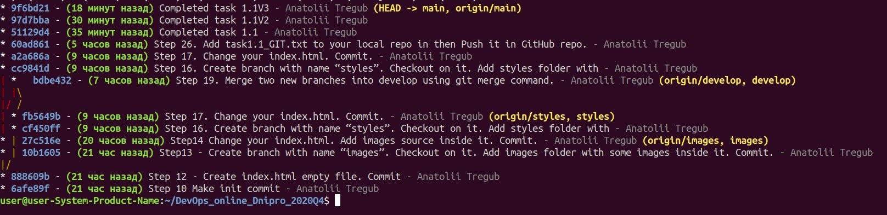

#### Step28. Describe in your own words what DevOps is. Try to use not more 50 words.
Devops it's a philosophy which include best practice and technology. Responsibility and deep involved is the main attribute of a good professional.

#### Step 27. Make file readme.md in folder task1.1 and describe results of your workwith Git
In the module 1 task 1.1 I am on practice applied knowledge about git. Before I'm not use github repository and make practice local environment only. First I am setup global config and setup default editor. In this task I face to merge problem in Step 19 also I  did a mistake to create subcommit.
Major commands what I used are following: 

- git add
- git commit 
- git status 
- git checkout -b 
- git merge

#### Work with GIT
Install git 

    sudo apt-get install git-all

First configure GIT 
		
	git config --global user.name "Anatolii Tregub"
	git config --global user.email tregubanatolii@gmail.com

Setup core settings 

	git config --global core.editor "vim"

Step 6 clone repo to my environment 

    git clone https://github.com/anatolii172 DevOps_online_Dnipro_2020Q4.git

Step 7-10

	mkdir -p m1/task1.1
	touch readme.txt
	it add .
	git commit -m "Step 10 Make init commit"

Step 11 - Create develop branch and checkout on it.

	git checkout -b develop

Step 12 - Create index.html empty file. Commit.

	git add index.html 
	git commit -m "Step 12 - Create index.html empty file. Commit"

Step13 - Create branch with name “images”. Checkout on it. Add images folder with some images inside it. Commit.

	git checkout -b images
	mkdir images
	git add images/
	git commit -m “Step13 - Create branch with name “images”. Checkout on it. Add images folder withsome images inside it. Commit.”

Step14 Change your index.html. Add images source inside it. Commit.

Step 15. Go back to develop branch.

	git checkout develop

Step 16. Create branch with name “styles”. Checkout on it. Add styles folder with styles source inside it. Commit.

    git checkout -b styles
    mkdir styles
    touch styles/styles.source

Step 17. Change your index.html. Commit.

    git add index.html 
    git commit -m "Step 17. Change your index.html. Commit."

Step18. Go to develop branch.

    git checkout develop 

Step 19. Merge two new branches into develop using git merge command. Resolve
conflict if it appear. Do it in next sequence:
•merge “images” into “develop”
•merge “styles” into “develop”

    git merge images

fix issue

    git merge styles

Step 20. Do not delete any branches!

Step 21. Merge develop into master.
   
    git checkout main

Step 22. Try to inspect your repository with git log command. Use different options with this command (git log --help).

Step 23. Push all your changes with all your branches to origin (git push origin --all).

Step 24. Execute command “git reflog“ and save it content somewhere (not in repository) with filename “task1.1_GIT.txt”.

    git reflog>task1.1_GIT.txt

Step25. Add in repository your trainers as collaborators (see GitHub accounts in General-->Wiki--> Trainers team).

Step 26. Add task1.1_GIT.txt to your local repo in then Push it in GitHub repo.

Step 27. Make file readme.md in folder task1.1 and describe results of your work with Git.

Step 28. Describe in your own words what DevOps is. Try to use not more 50 words. Do not use ctrl-C/ctrl-V.

Step 29. Insert your text about DevOps in readme.md.
#### Final result IMG
