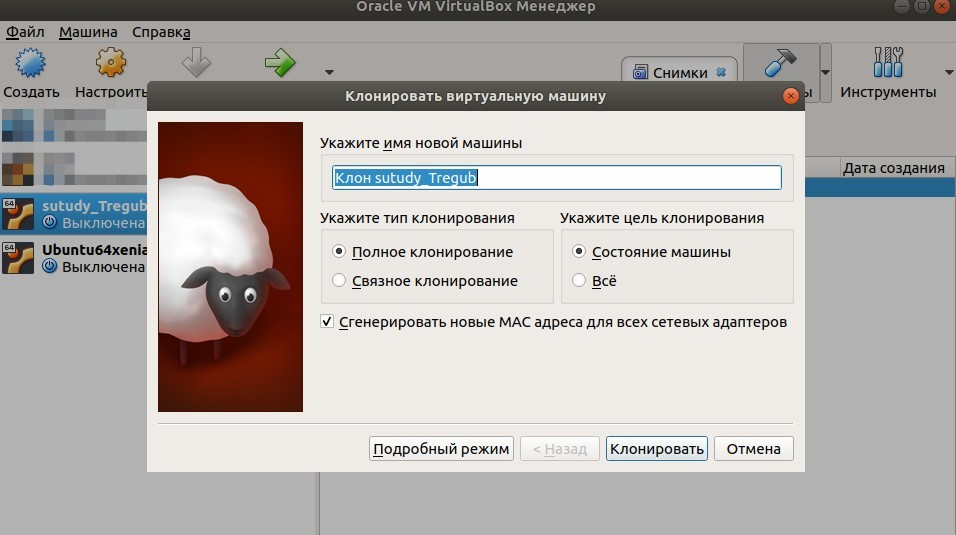
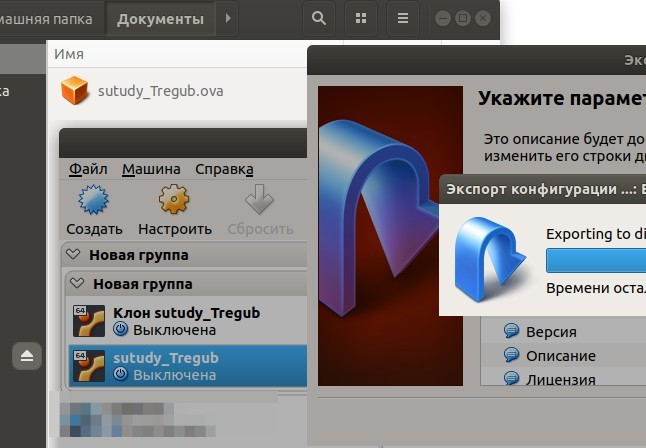
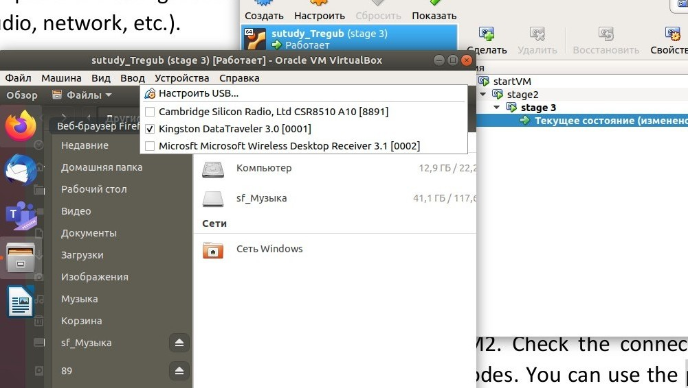
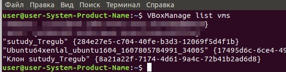
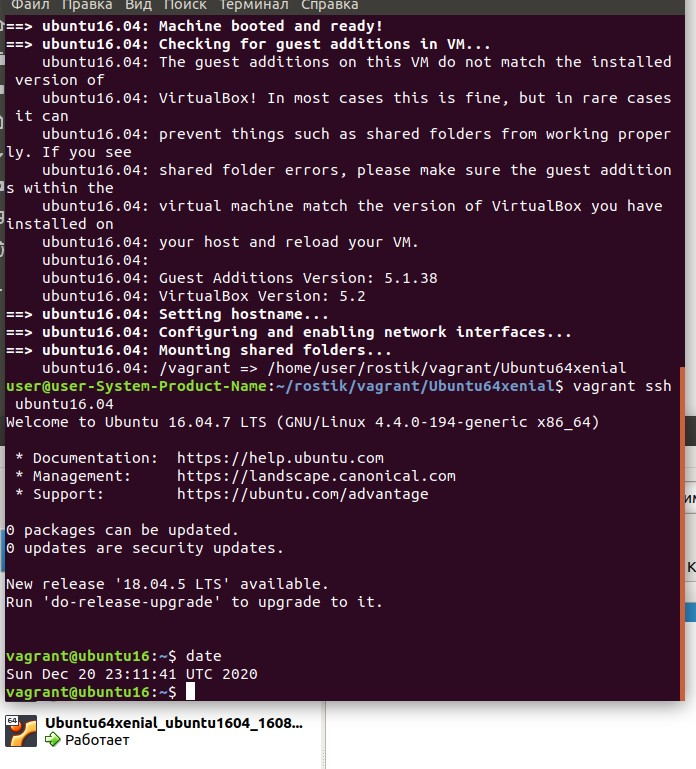

### PART 1. HYPERVISORS
#### What are the most popular hypervisors for infrastructure virtualization?

- VMware 
- Microsoft Hyper-V
- XenServer
- VirtualBox
- Red Hat Enterprise Virtualization Hypervisor (REVH)
- KVM
- Parallels
- Qemu

#### Briefly describe the main differences of the most popular hypervisors.

There are two types of hypervisors "Type 1" and "Type 2". Type 1 hypervisors are “standalone hypervisors” that run directly on the host hardware. Type 1 hypervisors include Xen, Oracle VM Server for SPARC, Oracle VM Server for x86, Microsoft Hyper-V, and VMware ESX / ESXi. Type 2 hypervisors run on the OS like an application of the system. Examples of Type 2 hypervisors are VMware Workstation, VMware Player, VirtualBox, and Parallels Desktop for Mac.

### PART 2. WORK WITH VIRTUALBOX

##### 1 First run VirtualBox and Virtual Machine (VM).

1.1 Get acquainted with the structure of the user manual VirtualBox [1] (see list of
references in the end of the document)
1.2 From the official VirtualBox site [2] download the latest stable version of
VirtualBox according to the host operating system (OS) installed on the student's
workplace. For Windows, the file may be called, for example,
VirtualBox-6.1.10-138449-Win.exe. Install VirtualBox.
1.2 Download the latest stable version of Ubuntu Desktop or Ubuntu Server from
the official site [3].
1.3 Create VM1 and install Ubuntu using the instructions [1, chapter 1.8]. Set machine
name as "host machine name"_"student last name"
1.4 Get acquainted with the possibilities of VM1 control - start, stop, reboot, save state,
use Host key and keyboard shortcuts, mouse capture, etc. [1, ch.1.9].
1.5 Clone an existing VM1 by creating a VM2 [1, ch.1.14].

1.6 Create a group of two VM: VM1, VM2 and learn the functions related to groups [1,
ch.1.10].
1.7 For VM1, changing its state, take several different snapshots, forming a branched
tree of snapshots [1, ch.1.11].
1.8 Export VM1. Save the *.ova file to disk. Import VM from *.ova file [1, ch.1.15].

##### 2. Configuration of virtual machines

2.1 Explore VM configuration options (general settings, system settings, display,
storage, audio, network, etc.).2.2 Configure the USB to connect the USB ports of the host machine to the VM
[1, ch.3.11].
2.3 Configure a shared folder to exchange data between the virtual machine and
the host [1, ch.4.3].
2.4 Configure different network modes for VM1, VM2. Check the connection
between VM1, VM2, Host, Internet for different network modes. You can use the ping
command to do this. Make a table of possible connections.

##### 3. Work with CLI through VBoxManage.

3.1 Run the cmd.exe command line.
3.2 Examine the purpose and execute the basic commands of VBoxManage list,
showvminfo, createvm, startvm, modifyvm, clonevm, snapshot, controlvm [1, ch.8].

vboxmanage list ostypes (Просмотреть список подерживаемых типов ОС)
VBoxManage startvm --type headless VirtualVMS (Запускает ВМ)
VBoxManage controlvm VirtualVMS poweroff (Выключает ВМ)
VBoxManage showvminfo (Покзывает информацию о ВМ)

#### PART 3. WORK WITH VAGRANT

1 Download the required version.....
2 Run the powershell. Create a folder "student name" (in English). In this example, create a folder vagrant_test. Next, go to the folder.
3 Initialize the environment ...
4 Run vagrant up and watch for messages during VM boot and startup.
5 Connect to the VM using the program PuTTY (can be downloaded from ...
6 Record the date and time by executing the date command

	# -*- mode: ruby -*-
	# vi: set ft=ruby :
	
	Vagrant.configure("2") do |config|
	
	config.vm.define "ubuntu16.04" do |ubuntu16|
	 ubuntu16.vm.box = "ubuntu/xenial64"
	 ubuntu16.vm.box_version = "20201124.0.0 "
	 ubuntu16.vm.network "private_network", ip: "192.168.15.10"
	
	 ubuntu16.vm.hostname = "ubuntu16.04"
	 ubuntu16.vm.provider "virtualbox" do |ubuntu16up|
	  ubuntu16up.memory = 2048
	  ubuntu16up.cpus = 2
	  end
	 end
	end

7 Stop and delete the created VM.

8 Create your own Vagrant box

[Building Custom Vagrant box](https://medium.com/@gajbhiyedeepanshu/building-custom-vagrant-box-e6a846b6baca) 

9 (optional) Create a test environment from a few servers. Servers' parameters are chosen independently by the student.

	# -*- mode: ruby -*-
	# vi: set ft=ruby :
	
	Vagrant.configure("2") do |config|
	
	 config.vm.define "ubuntu16.04" do |ubuntu16|
	 ubuntu16.vm.box = "ubuntu/xenial64"
	 ubuntu16.vm.box_version = "20201124.0.0 "
	 ubuntu16.vm.network "private_network", ip: "192.168.15.11"
	 ubuntu16.vm.hostname= "ubuntu"
	 end
	
	 config.vm.define "centos" do |centos|
	 centos.vm.box = "centos/7"
	 centos.vm.box_version = "1804.02"
	 centos.vm.network "private_network", ip: "192.168.15.12"
	 centos.vm.hostname = "centos"
	 end
	
	end