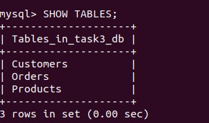
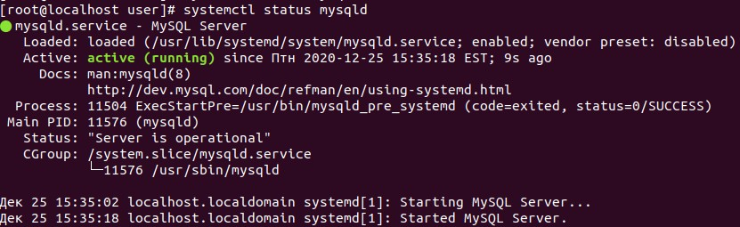

#### Module 3 Database Administration

##### TASK 3.1
##### PART 1

1 Download MySQL server for your OS on VM.

	yum install -y epel-release 
	yum -y update
	yum install -y vim mc wget
	wget https://dev.mysql.com/get/mysql80-community-release-el7-1.noarch.rpm

2 Install MySQL server on VM.

	rpm -Uvh mysql80-community-release-el7-1.noarch.rpm
	yum install -y mysql-server
	
3 Select a subject area and describe the database schema, (minimum 3 tables)

It's will be simple database of common shop which include 3 table: Customers, Products, Orders.

4 Create a database on the server through the console. 

	Получаем временный пароль от базы, настраиваем пользователя рут от неё и создаем постоянный пароль
	
	    systemctl start mysqld
	    systemctl status mysqld
	    systemctl enable mysqld
	    grep 'temporary password' /var/log/mysqld.log
	
	В сообщении будет явно виден временный пароль.

 Подключаемся к БД
	

	
	    mysql -uroot -p
		Меняем временный пароль, на свой командой:
	    >ALTER USER 'root'@'localhost' IDENTIFIED BY 'PASSWORD';
	Далее создаем новую базу данных и пользователя:
	    >create database task3_db character set utf8 collate utf8_bin;
	Выходим из mysql командой quit.
	

5 Fill in tables.

6 Construct and execute SELECT operator with WHERE, GROUP BY and ORDER BY.

WHERE взять из 
SELECT  code FROM country WHERE code = 'AFG';

GROUP BY   выбрать что то из списка и сгруппировать.
    -> SELECT continent 
    -> FROM country
    -> GROUP BY continent;

ORDER BY сортировка по возрастания  c DESC по убыванию 

7 Execute other different SQL queries DDL, DML, DCL.
Data Definition Language (DDL) – это группа операторов определения данных: CREATE, ALTER, DROP
DML – Data Manipulation Language:  SELECT, INSERT UPDATE DELETE
DCL – Data Control Language: GRANT, REVOKE, DENY

8 Create a database of new users with different privileges. Connect to the database as a new user and verify that the privileges allow or deny certain actions.

	  >create user user@localhost identified with mysql_native_password by 'PASSWORD';
	Не дадим права
	Выходим из mysql командой quit.

9 Make a selection from the main table DB MySQL.

##### PART 2
10 Make backup of your database.

    mysql -uroot -p task3_db > task3_db_bak.sql
    
11 Delete the table and/or part of the data in the table.
12 Restore your database.

    mysql -uroot -p task3_db < task3_db_bak.sql

13 Transfer your local database to RDS AWS.
14 Connect to your database.
15 Execute SELECT operator similar step 6.
16 Create the dump of your database.

###### PART 3
17 Create an Amazon DynamoDB table
18 Enter data into an Amazon DynamoDB table.
19 Query an Amazon DynamoDB table using Query and Scan.
