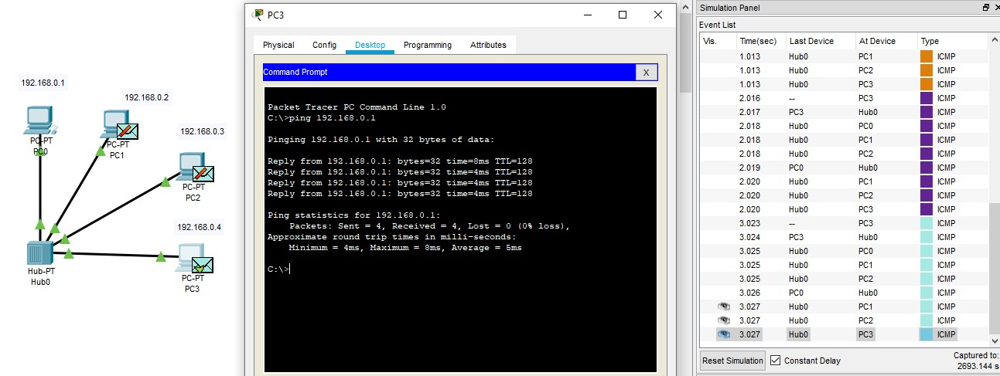

### TASK 4.1

##### Зібрати наступний проект, 
який містить в собі: 4 ПК типу PC-PT, Концентратор (Hub-PT). Кожен комп'ютер повинен бути з'єднаний з концентратором за допомогою крученої пари (Copper Straight-through).Кожному ПК привласнити унікальну IP адресу

Перейти в режим Simulation і за допомогою кнопки Event List викликати вікно відображення подій в мережі Simulation Panel. Використовуючи кнопку Auto Capture / Play запустити симуляцію роботи ICMP пакетів. Простежити просування пакетів по мережі і зберегти даний скріншот.

Простежити за порядком і шляхом проходження пакетів у вікні Simulation Panel. Зберегти даний скріншот. 

Переглянути інформацію о пакетах з вікна Simulation Panel і їх відповідність моделі OSI шляхом подвійного клацання по пакету в вікні (рис.

######Зібрати наступний проект.
У нього входять: PC0-PC5, Server, 2 Hubs. Однойменні пристрої з'єднуються за допомогою кросового кабелю

Перевірити працездатність мережі.

12-13 Створити новий проект, який включає в себе: 4 ПК типу PC-PT,
Комутатор (Switch).

14-17 Розширити проект. У нього входять: 8 ПК типу PC-PT, 2 комутатори (Switch).

18-22 Існуючу мережу розбити на дві рівні підмережі. І з'єднати їх за допомогою маршрутизатора Router-PT з декількома портами. Маршрутизатор і комутатори з'єднати між собою за допомогою оптоволокна (Fiber).

23Проаналізувати відмінності в роботі мережі Топології 4 і Топології. Оцінити можливості, які дає використання маршрутизатора.
При использовании роутера сетьразбивается на широковещательные домены тем самым сокращается трафик типа широковещательный шторм.
