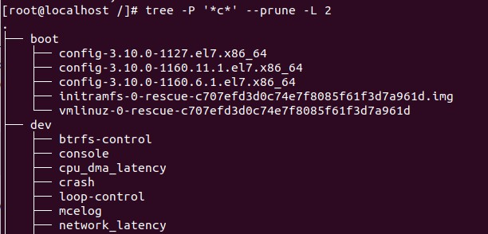

### TASK 5.1

Part1

- Log in to the system as root.
- Use the passwd command to change the password. Examine the basic parameters of the command. What system file 
does it change *?

its will add/modify record in the file /etc/passwd

- Determine the users registered in the system, as well as what commands they execute. What additional information can be gleaned from the command execution?

user "bob" 

bob:x:1001:1001::/home/bob:/bin/bash
username:x:UID:GID:user information:home-directory:login-shell

- Change personal information about yourself

to change information I use command chfn

Become familiar with the Linux help system and the man and info commands.

result of man 

- Get help on the previously discussed commands, define and describe any twokeys for these commands. Give examples.

If we use key -f in comman "chfin"  we will cnange only username 

sudo chfn -f 'New name' user

- Explore the more and less commands using the help system. View the contents of files .bash* using commands.

        history |more
        history |less

If use command more you can scroll down but not up.
if use command less you can do it both side.

7) * Describe in plans that you are working on laboratory work 1. Tip: You should read the documentation for the finger command.

In lab we check command finger and way to modify user info.

8) * List the contents of the home directory using the ls command, define its files and directories. Hint: Use the help system to familiarize yourself with the ls command.

#### Part2

- Examine the tree command. Master the technique of applying a template, for example, display all files that contain a character c, or files that contain a specific sequence of characters. List subdirectories of the root directory up to and including the second nesting level.

use option -P and mask '*c' to det mask of search. Option --prune will not include mismatch folder

- What command can be used to determine the type of file (for example, text or binary)? Give an example.

To determine the file type of a file pass the name of a file to the file command.

        file file.txt
        file.txt: ASCII text

- Master the skills of navigating the file system using relative and absolute paths. How can you go back to your home directory from anywhere in the filesystem?

An absolute path is defined as specifying the location of a file or directory from the root directory(/). In other words,we can say that an absolute path is a complete path from start of actual file system from / directory.
Relative path is defined as the path related to the present working directly(pwd). It starts at your current directory and never starts with a /

        cd ~  #go back to your home directory from anywhere

- Become familiar with the various options for the ls command. Give examples of listing directories using different keys. Explain the information displayed on the terminal using the -l and -a switches.

        ls        #list files in the simpe way
        ls-l      #list files in long way
        ls -la   #list files in long way plus will show hidden files 

-Perform the following sequence of operations:

create a subdirectory in the home directory;

        mkdir -p /home/subdir

in this subdirectory create a file containing information about directories located in the root directory (using I/O redirection operations);
        
        ls / >/home/subdir/iformation.txt 

view the created file

copy the created file to your home directory using relative and absolute addressing.

delete the previously created subdirectory with the file requesting removal;
delete the file copied to the home directory.

- Perform the following sequence of operations:

create a subdirectory test in the home directory
copy the .bash_history file to this directory while changing its name to labwork2
create a hard and soft link to the labwork2 file in the test subdirectory

        mkdir -p /home/test 
        cp .bash_history /home/test/ && mv .bash_history labwork2
        ln labwork2 hardlink
        ln -s labwork2 softlinklink

how to define soft and hard link, what do theseconcepts

change the data by opening a symbolic link. What changes will happen andwhy

        touch -a softlink

rename the hard link file to hard_lnk_labwork2;
rename the soft link file to symb_lnk_labwork2 file;
then delete the labwork2. What changes have occurred and why?

        mv hardlink hard_lnk_labwork2
        mv softlinklink symb_lnk_labwork2
        rm labwork2
        

- Using the locate utility, find all files that contain the squid and traceroute sequence.

- Determine which partitions are mounted in the system, as well as the types of these partitions.

        lsblk
        parted -l
        df -h
        
- Count the number of lines containing a given sequence of characters in a given file.

        wc -l yourTextFile
        
- Using the find command, find all files in the /etc directory containing the host character sequence.

        find /etc/ -name 'text-to-find-here'

- List all objects in /etc that contain the ss character sequence. How can I duplicate a similar command using a bunch of grep?

        find /etc/ -name '*ss*'
        grep -nr '*ss*' /etc/

- Organize a screen-by-screen print of the contents of the /etc directory. Hint: You must use stream redirection operations.

        ls /etc/ |less

- What are the types of devices and how to determine the type of device? Give examples.
       
        ls -l
        brw-rw----    b - block
        crw-rw-rw-   c - character
        srw-rw-rw-   s - socket
        prw-r--r--      p - pipe

Character Device
These devices transfer data, but one a character at a time. You'll see a lot of pseudo devices (/dev/null) as character devices, these devices aren't really physically connected to the machine, but they allow the operating system greater functionality.

Block Device
These devices transfer data, but in large fixed-sized blocks. You'll most commonly see devices that utilize data blocks as block devices, such as harddrives, filesystems, etc.

Pipe Device
Named pipes allow two or more processes to communicate with each other, these are similar to character devices, but instead of having output sent to a device, it's sent to another process.

Socket Device
Socket devices facilitate communication between processes, similar to pipe devices but they can communicate with many processes at once.

- How to determine the type of file in the system, what types of files are there?

        df -Th
        lsblk -f
        blkid /dev/*
        parted -l
        
- * List the first 5 directory files that were recently accessed in the /etc
directory.

     find /etc/ -mtime -60 | head -n 5