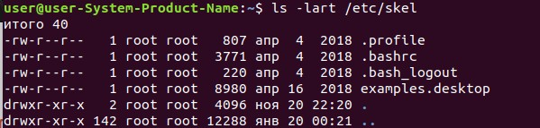

### TASK 5.2

1. Analyze the structure of the /etc/passwd and /etc/group file, what fields are present in it, what users exist on the system? Specify several pseudo-users, how to define them?

UIDs 1–10 are reserved for pseudo-users accounts.
bin,sys...

2. What are the uid ranges? What is UID? How to define it?

A UID (user identifier) is a number assigned by Linux to each user on the system. This number is used to identify the user to the system and to determine which system resources the user can access.

UID 0 (zero) is reserved for the root.
UIDs 1–99 are reserved for other predefined accounts.
UID 100–999 are reserved by system for administrative and system accounts/groups.
UID 1000–10000 are occupied by applications account.
UID 10000+ are used for user accounts.

3. What is GID? How to define it?

Groups in Linux are defined by GIDs (group IDs).
GID 0 (zero) is reserved for the root group.
GID 1–99 are reserved for the system and application use.
GID 100+ allocated for the user’s group.

4. How to determine belonging of user to the specific group?

manual way to check /etc/groups
or run command id "user" and its will show all groups belongs to the user.

5. What are the commands for adding a user to the system? What are the basic parameters required to create a user?

	adduser will ask to input password immediately
	useradd just create user.
	basic parameters are full name, room and phones, etc.

6. How do I change the name (account name) of an existing user?

usermod -l login-name old-name

7. What is skell_dir? What is its structure?

Directory /etc/skel/ (skel is derived from the “skeleton”) is used to initiate home directory when a user is first created.

 

8. How to remove a user from the system (including his mailbox)?

        userdel -r  username

9. What commands and keys should be used to lock and unlock a user account?

to lock user accaunt
	
	passwd -l username
	or 
	usermod -l username
	
to unlolck user accaunt
	
	passwd -u username
	sermod -U username

10. How to remove a user's password and provide him with a password-free login for subsequent password change?

To force a user to change his/her password, first of all the password must have expired and to cause a user’s password to expire. 

      passwd --expire user
      chage -l  user
      

11.  Display the extended format of information about the directory, tell about the information columns displayed on the terminal.

        ls -lah

-l displays permissions, links, owner, group, size, time, name
-a lists all entries including those starting with a period (.).
-h displays file sizes using more human-friendly units.

12) What access rights exist and for whom (i. e., describe the main roles)?

the user(creator) of the file
the group to which that owner belongs to
the other.

Briefly describe the acronym for access rights.

Ugo is the abbreviation for user access, group access, and other system user's access

13. What is the sequence of defining the relationship between the file and the user?

	The result of ls -lsays:
	
	-rw-r--r-- 1 linuxsir root 1549 Feb 23 19:16 test.txt
	It means:
	
	user linuxsir is owner and can read and write on test.txt
	group root can only read
	Anyone else can only read

14. What commands are used to change the owner of a file (directory), as well as the mode of access to the file? Give examples, demonstrate on the terminal.

	chown user:user filename

15. What is an example of octal representation of access rights? Describe the umask command.

example octal: "724"
Owner - 7
Group - 2
Other - 4
umask is a command that determines the settings of a mask that controls how file permissions are set for newly created files

16. Give definitions of sticky bits and mechanism of identifier substitution. Give an example of files and directories with these attributes.

sticky bit is a user ownership access right flag that can be assigned to files and directories on Unix-like systems.
The letters rwxXst select file mode bits for the affected users: read (r), write (w), execute (or search for directories) (x), execute/search only if the file is a directory or already has execute permission for some user (X), set user or group ID on execution (s), restricted deletion flag or sticky bit (t).

17. What file attributes should be present in the command script?
file should has +x attribute