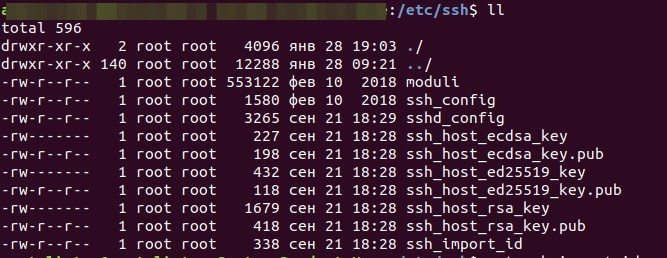

### TASK 5.3

####Part1

1. How many states could has a process in Linux?

Linux has basically 5 states: Running, Runnable, Sleeping, Stopped, Zombie

2. Examine the pstree command. Make output (highlight) the chain (ancestors) of the current process.

 

3. What is a proc file system?

/proc file system is a mechanism provided, so that kernel can send information to processes. This is an interface provided to the user, to interact with the kernel and get the required information about processes running on the system. 

4. Print information about the processor (its type, supported technologies, etc.).

There are the few commands do almost the same:

	cat /proc/cpuinfo
	lscpu
	sudo dmidecode --type processor
	lshw -C CPU

 

5. Use the ps command to get information about the process. The information should be as follows: the owner of the process, the arguments with which the process was launched for execution, the group owner of this process, etc.

        ps -ao user,args,group,pid,sid,pcpu,tty,size,uid
	 
 

6. How to define kernel processes and user processes?

The linux kernel processes are started by the kernel itself, while the parent process supposedly spawned them, the kthread process is assigned, with PID = 2.  Kernel processes should be considered as the process itself with PID = 2, as well as processes for which the PID (i.e. parent pid) is 2.

	sudo ps --ppid=2 --pid=2
	#User processes - all others:
	sudo ps -N --ppid=2 --pid=2
	

7. Print the list of processes to the terminal. Briefly describe the statuses of the processes.
What condition are they in, or can they be arriving in?

        ps -aux | head -n 5
        
the same like in task 1

8. Display only the processes of a specific user.

         ps -u "specific user" | head -n 5
         
 

9. What utilities can be used to analyze existing running tasks (by analyzing the help for the ps
command)?

After analysing command "ps --help" I see that commonly display PID, name of user/process, nice, and etc. This data need to use utilities such us kill/pkill and nice. Similar things do top and htop.

10. What information does top command display?

Top command displays processor activity  and also displays tasks managed by kernel in real-time.

12. Display the processes of the specific user using the top command.

        top -u “user name”

12. What interactive commands can be used to control the top command? Give a couple of
examples.

Press (Shift+O) to Sort field via field letter
Press ‘z‘ option in running top command will display running process in color
Press ‘c‘ option in running top command, it will display absolute path of running process
By default screen refresh interval is 3.0 seconds, same can be change pressing ‘d‘ option in running top command and change it

13. Sort the contents of the processes window using various parameters (for example, the
amount of processor time taken up, etc.)

To open window with a lot of option of sort parameters need press "Shift +f". After need to select interested field and press "d" to select and "s" to save.
To sort by time anouth just pess "Shift +t".

14. Concept of priority, what commands are used to set priority?

nice command in Linux helps in execution of a program/process with modified scheduling priority.

15. Can I change the priority of a process using the top command? If so, how?

Yes, need to run top with "root" privilege and press "r". After input "PID" and type new value on nice.

16. Examine the kill command. How to send with the kill command process control signal? Give an example of commonly used signals.

Kill -9 brut close of procces and kill -15 normal way to close.

 

17. Commands jobs, fg, bg, nohup. What are they for? Use the sleep, yes command to
demonstrate the process control mechanism with fg, bg.

By default, any executed command is started as a foreground job. That means that you cannot do anything on the terminal where the command was started until it is done.
Jobs - Shows which jobs are currently running from this shell. Displays job numbers that can be used as an argument to the commands bg and fg.
fg - Brings back to the foreground the last job that was moved to background execution.
bg - Continues the job that has just been frozen using Ctrl-Z in thebackground.

 

####Part2

1. Check the implementability of the most frequently used OPENSSH commands in the MS Windows operating system. (Description of the expected result of the commands + screenshots: command – result should be presented)

Nowadays Windows support almost all command of SSH accept ssh-copy-id. ALL supported commands located us the file in the: located at  c:\windows\system32\OpenSSH\
"ssh-keygen -t ed25519" will generate ssh key ed25519. During creation better select directory. By default it will use system32 folder.

 

2. Implement basic SSH settings to increase the security of the client-server connection (at least

Add the line: Protocol2
Avoid Port 22
Reject Connection Requests With No Passwords/Use SSH Keys Instead of Passwords
Set a Limit For Password Attempts

	#In file /etc/ssh/sshd_config chanhe/add
	Protocol 2
	Port 1989
	PassworAutentification no
	Disable X11 Forwarding yes

3. List the options for choosing keys for encryption in SSH. Implement 3 of them.

RSA, DSA, ED25519
ssh-keygen -b 4096 -C "Example RSA Key"
ssh-keygen -t dsa
ssh-keygen -t ed25519 -C "Example Ed25519 key"

 

 

4. Implement port forwarding for the SSH client from the host machine to the guest Linux
virtual machine behind NAT.

 

5*. Intercept (capture) traffic (tcpdump, wireshark) while authorizing the remote client on the
server using ssh, telnet, rlogin. Analyze the result.

 

 

 

To collect data both app behave the same. Both of them has problem to recognize telnet traffic. Benefit of tcpdum is no need install it. By default it's can be included in OS. If not, we can install tshark.