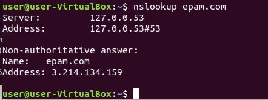

### TASK 6.1 Networking with Linux

1. Create virtual machines connection according to figure.

Configure VM1 server 
vim /etc/network/interfaces

        # The primary network interface
	auto enp0s3
	iface enp0s3 inet dhcp
	
	auto enp0s8
	iface enp0s8 inet static
	address 192.168.10.254
	netmask 255.255.255.0

Install the "dnsmasq" package, it is needed to redirect DNS requests to upstream servers.

	apt-get install dnsmasq

net.ipv4.ip_forward=1

Allow packet forwarding:
vim /etc/sysctl.conf    need to find the line and remove the comment from it:

        net.ipv4.ip_forward=1

add rules for routing packets in /etc/rc.local 

	iptables -F
	iptables -t nat -A POSTROUTING -o enp0s3 -j MASQUERADE
	iptables -A FORWARD -i enp0s3 -o enp0s3 -j REJECT
	iptables -I FORWARD -p tcp --tcp-flags SYN,RST SYN -j TCPMSS --clamp-mss-to-pmtu
	exit 0
	
 

2. VM2 has one interface (internal), VM1 has 2 interfaces (NAT and internal). Configure all network  interfaces in order to make VM2 has an access to the Internet (iptables, forward, masquerade).

 

3. Check the route from VM2 to Host.

 

4. Check the access to the Internet, (just ping, for example, 8.8.8.8).

 

5. Determine, which resource has an IP address 8.8.8.8.

 

6. Determine, which IP address belongs to resource epam.com.

 

Name:	epam.com
Address: 3.214.134.159

7. Determine the default gateway for your HOST and display routing table.

 

 

8. tr the route to google.com.

 